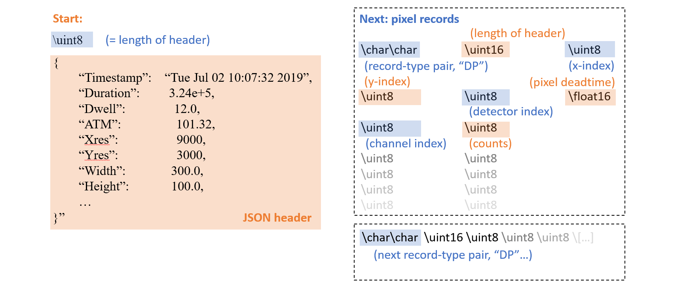
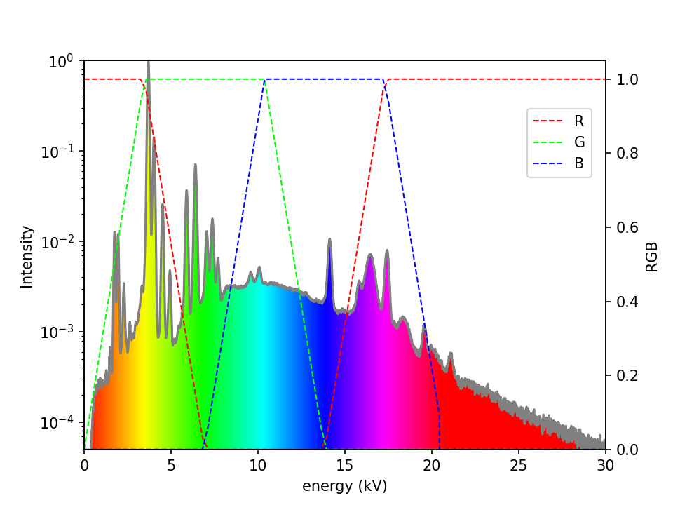
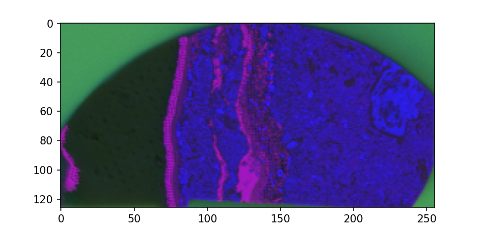
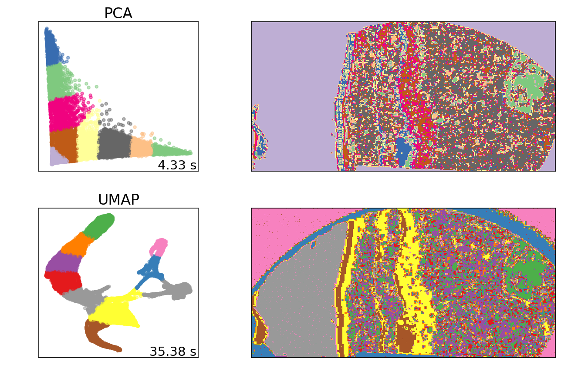

# About the project

ReadoutXFM is a Python3 tool for parsing and analysis of X-ray Flourescence Microscopy (XFM) hyperspectral maps. It is currently compatible with ATLAS-series spectrometers from IXRF Inc., and the GeoPIXE analysis package from CSIRO.  It performs read/write operations on the binary IXRF/CSIRO dataformat, and calculates a range of statistics and visualisations.

# Usage

```py
usage: main.py -f source [-o destination] [-e] [-w] [-x X1 X2] [-y Y1 Y2] [-i] [-a] [-c] [-dt] [-m] [-s SIZE]

required arguments:
-f --input-file             .GeoPIXE file to be parsed

optional arguments:
-h --help                   show this help message and exit
-o --output-directory       destination to write extracted files and analysis outputs (defaults to data location)
-i --index-only             index pixel headers only, do not extract spectrum data
-w --write-modified         write a .GeoPIXE file including modifications specified by eg. [-x] [-y] [-dt]
-x --x-coords               set the START and END coordinates in X dimension for cropping
-y --y-coords               set the START and END coordinates in Y dimension for cropping
-e --export-data            export the full spectrum-by-pixel-by-detector 3D dataset to NumPy .npy file
-a --analyse                perform basic analysis operations (eg. colour map, deadtime statistics)
-c --classify-spectra       perform spectral classification (eg. PCA, UMAP, K-means)
-dt --fill-deadtimes        predict deadtime statistics from spectra
-m --multiprocess           pre-cache memory using multi-processing
-s --chunk-size             set the size of memory buffer (in Mb) to load at a time (eg. 1000)

```

# Examples

Perform analysis and dimensionality reduction on example dataset:
```py
python main.py -f ./data/example_dataset.GeoPIXE -o ./out/ -a -c
```

Rapidly extract pixel header statistics and visualise deadtime data:
```py
python main.py -f ./data/example_dataset.GeoPIXE -o ./out/ -i -a
```

Produce a submap cropped to coordinates (20,10) to (40,30):
```py
python main.py -f ./data/example_dataset.GeoPIXE -o ./out/ -i -w -x 20 40 -y 10 30 
```
Use spectrum data to predict missing deadtime statistics and write new file for further processing:
```py
python main.py -f ./data/example_dataset.GeoPIXE -o ./out/ -w -dt 
```
# Data format

The instrument data format is a mixed JSON/binary with sparse pixel records.

- The JSON file header contains the run parameters and sample and instrument metadata

- The data itself is a series of highly compact, binary pixel records
- Each record contains: 
    - A pixel header specifying statistics related to the following pixel (eg. length of record, coordinates, deadtime).

    - A block of channel/count pairs containing the spectrum data. Channels where counts are 0 are omitted.  

<p align="left">
  
  <br />
</p>

# File operations

The data is read in chunks to minimise memory usage
- Each chunk is stored into a MapBuffer object together with the original starting byte index. 
- Multiple MapBuffer objects can be loaded in parallel via MapBuffer.cache() and retrieve() methods to minimise I/O delay. 
- The active chunk is accessed via the getstream() function, which handles loading across the end of each chunk
- The binary data is extracted this stream via struct.unpack
    - see: xfmreadout/bufferops.py and xfmreadout/byteops.py

The input and extracted data is handled via two custom classes:
- The Xfmap object wraps the input dataset together with metadata derived from the JSON header.
- The PixelSeries object holds the extracted data as a series of NumPy arrrays containing pixel statistics and the 3D data-cube.  
    - see: xfmreadout/structures.py

The file is parsed in three stages
 - The file is first indexed to extract the pixel header statistics and store the location and length of each pixel record
 - These pre-identified indices are then used to step through the pixel records rapidly, unpacking the binary pairs into channel and count NumPy arrays
    - Missing channels are reintroduced and the pixel data is loaded into a PixelSeries object
 - Finally, if a modified .GeoPIXE file is to be written, the file is indexed a second time, writing modified headers and data at each record index. 
    - see: xfmreadout/parser.py

# Analytics

Spectra are mapped to an RGB colourspace using a HSV colourmap

<p align="left">
  
  <br />
</p>

An X*Y map is created using these RGB values to produce an at-a-glance visualisation of the mapped regions
<p align="left">
  
  <br />
</p>

Spectra are categorised via PCA, UMAP and K-means to produce a classified map and class-average spectra for further processing

<p align="left">
  
  <br />
</p>